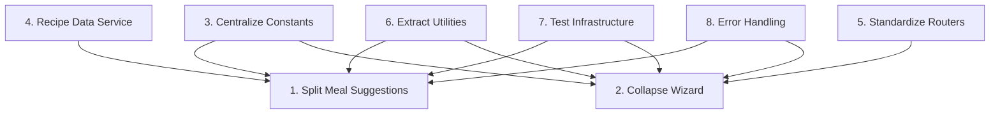

# HoneyDo Refactoring Plan

> Technical debt reduction and code quality improvements

## Overview

This document tracks refactoring work to improve code maintainability, reduce duplication, and establish consistent patterns across the codebase. These refactors are non-functional changes that improve developer experience and code quality.

## Philosophy

**Refactors should:**
- Reduce cognitive load when navigating code
- Eliminate duplication that causes bugs
- Establish patterns that scale
- Make testing easier
- Not change external behavior

## Refactors

| # | Refactor | Priority | Status | Impact |
|---|----------|----------|--------|--------|
| 1 | [Split Meal Suggestions Service](./features/1-split-meal-suggestions/PLAN.md) | High | ✅ Done | Reduces 975-line file to focused modules |
| 2 | [Collapse Wizard Router Files](./features/2-collapse-wizard/PLAN.md) | High | ✅ Done | Reduces 12 files to 5-6 |
| 3 | [Centralize Constants](./features/3-centralize-constants/PLAN.md) | High | ✅ Done | Eliminates magic strings |
| 4 | [Recipe Data Service](./features/4-recipe-data-service/PLAN.md) | Medium | ✅ Done | Single source for recipe data |
| 5 | [Standardize Router Composition](./features/5-standardize-routers/PLAN.md) | Medium | ⏳ Planned | Consistent API patterns |
| 6 | [Extract Shared Utilities](./features/6-extract-utilities/PLAN.md) | Medium | ✅ Done | Progress, dates, JSON parsing |
| 7 | [Add Test Infrastructure](./features/7-test-infrastructure/PLAN.md) | Medium | ⏳ Planned | Enable testing |
| 8 | [Error Handling Standardization](./features/8-error-handling/PLAN.md) | Low | ⏳ Planned | Consistent error patterns |

Status: ✅ Done | 🚧 In Progress | ⏳ Planned | ❌ Blocked

## Dependency Graph

**Recommended Order:**
1. **Phase 1 (Foundation):** #3 Centralize Constants, #6 Extract Utilities
2. **Phase 2 (Services):** #4 Recipe Data Service, #1 Split Meal Suggestions
3. **Phase 3 (Structure):** #2 Collapse Wizard, #5 Standardize Routers
4. **Phase 4 (Quality):** #7 Test Infrastructure, #8 Error Handling

## Success Metrics

| Metric | Before | Target |
|--------|--------|--------|
| Largest file (lines) | 975 | < 300 |
| Wizard router files | 12 | 5-6 |
| Magic string locations | ~50 | 0 |
| Duplicated code blocks | ~8 | 0 |
| Test coverage | 0% | 40%+ |

## Impact on Claude Code Efficiency

These refactors specifically improve AI-assisted development:

1. **Smaller files** - Less context needed per task
2. **Clear boundaries** - Easier to identify relevant code
3. **Consistent patterns** - Predictable code structure
4. **Centralized constants** - Searchable, type-safe values
5. **Test coverage** - Executable documentation of behavior

## Notes

- Each refactor should be done in isolation (separate branches/PRs)
- Run full type check and lint after each refactor
- Refactors should not change API contracts or database schema
- Update CLAUDE.md files after significant structural changes
